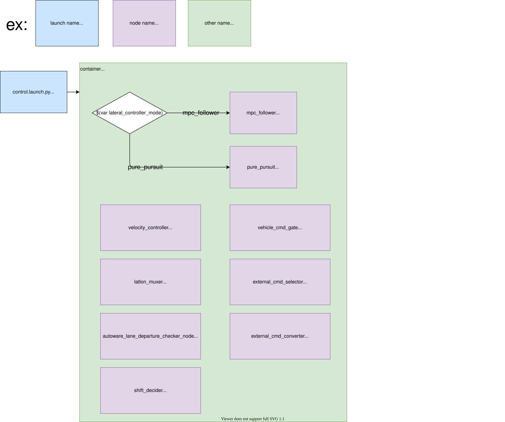

# autoware_control_launch

Shared control launch library. The system component launcher lives in the product layer (`autoware_launch/launch/components/component_control.launch.xml`); this package hosts the control launcher it wraps:

```bash
launch/
├── control.launch.xml                                    # control entry: preset, parameter paths, containers and the unit includes
├── trajectory_follower/trajectory_follower.launch.xml    # controller and lane departure checker
├── command_gate/command_gate.launch.xml                  # vehicle cmd gate (or control command gate), shift decider, operation mode transition manager
├── external_command/external_command.launch.xml          # external command selector and converter
└── control_checker/control_checker.launch.xml            # control validator, autonomous emergency braking, collision detector, optional checkers
design/module/                                            # Autoware System Designer modules, one per launch unit
├── Control.module.yaml
├── TrajectoryFollower.module.yaml
├── CommandGate.module.yaml
├── ExternalCommand.module.yaml
└── ControlChecker.module.yaml
```

## Structure



## Launch files

- `control.launch.xml` — the entry point. It includes the module preset, resolves every parameter file, pushes the `control` namespace and creates the two containers (`control_container` for the command path, `control_check_container` for the composable checkers), then includes one launch file per unit and the control evaluator.
- `trajectory_follower/trajectory_follower.launch.xml` — the controller (`trajectory_follower_mode`: `trajectory_follower_node`, `smart_mpc_trajectory_follower`, `none`) and the lane departure checker on its predicted trajectory. Boundary topics are `input/*` arguments, so the unit can also drive a standalone follower container.
- `command_gate/command_gate.launch.xml` — the vehicle cmd gate, or the control command gate with the stop mode operator when `mrm` is `command` or `driving`, plus the shift decider and the operation mode transition manager. `input/control_cmd` and `output/*_cmd` are its boundary topics.
- `external_command/external_command.launch.xml` — the external command selector and converter.
- `control_checker/control_checker.launch.xml` — the control validator, autonomous emergency braking, collision detector, obstacle collision checker and predicted path checker, each behind its `launch_*` flag.

Every unit accepts `target_container`, `use_intra_process` and `ld_preload_value`, so process placement is decided by the caller; parameter files default to the `autoware_control_config` tree and are overridden by the entry point.

## Config

Parameter files are resolved from a `config/` tree addressed through the `control_config_pkg` argument, which defaults to `autoware_control_config`. A product can relocate the whole tree by setting `control_config_pkg` once at its entry point — the launch configuration propagates through every include — but it must then ship the same `config/` layout. Products that differ in only a few files instead override the corresponding `*_param_path` arguments, which are all declared at the top of `control.launch.xml`:

```xml
<include file="$(find-pkg-share autoware_control_launch)/launch/control.launch.xml">
  <arg name="control_config_pkg" value="my_control_config"/>
  <arg name="FOO_NODE_param_path" value="..."/>
</include>
```

Which modules launch is a separate axis, selected by `module_preset`; the presets live in the config package under `config/preset/`. The controller algorithms are selected by `lateral_controller_mode` (`mpc`, `pure_pursuit`) and `longitudinal_controller_mode` (`pid`), which also pick the controller parameter files.

## Notes

For reducing processing load, we use the [Component](https://docs.ros.org/en/humble/Concepts/About-Composition.html) feature in ROS 2 (similar to Nodelet in ROS 1 )

## Package Dependencies

Please see `<exec_depend>` in `package.xml`.
