# autoware_localization_launch

Shared localization launch library. The system component launcher lives in the product layer (`autoware_launch/launch/components/component_localization.launch.xml`); this package hosts the localization launcher it wraps:

```bash
launch/
├── localization.launch.xml               # localization entry: pose/twist estimators, fusion filter, error monitor
├── pose_twist_estimator/                 # ndt, yabloc, eagleye, artag, lidar-marker and gyro odometer launchers
├── pose_twist_fusion_filter/             # ekf localizer, stop filter, twist2accel, pose instability detector
├── localization_error_monitor/
└── util/                                 # pointcloud downsampling for ndt
design/module/                            # Autoware System Designer modules
├── Localization.module.yaml              # localization component: same node set as localization.launch.xml
├── pose_twist_estimator/                 # ndt pose estimator and gyro odometer twist estimator
├── pose_twist_fusion_filter/
└── util/
```

## Structure



## Launch files

- `localization.launch.xml` — the entry point. It resolves every parameter file and pushes the `localization` namespace. Each estimator has its own junction flag (`use_ndt_pose`, `use_yabloc_pose`, `use_artag_pose`, `use_lidar_marker_pose`, `use_eagleye_pose`, `use_eagleye_twist`, `use_gyro_odom_twist`); running several pose estimators additionally takes `multi_localizer_mode` with the matching `pose_sources` list, which bring up the pose estimator arbiter and its input relays. The product component (`component_localization.launch.xml`) flattens its `pose_source`/`twist_source` selection into these flags. The fusion filter (EKF, stop filter, twist2accel, pose instability detector), the pose initializer utilities and the localization error monitor always launch.

## Config

Parameter files are resolved from a `config/` tree addressed through the `localization_config_pkg` argument, which defaults to `autoware_localization_config`. A product can relocate the whole tree by setting `localization_config_pkg` once at its entry point — the launch configuration propagates through every include — but it must then ship the same `config/` layout. Products that differ in only a few files instead override the corresponding `*_param_path` arguments, which are all declared at the top of `localization.launch.xml`:

```xml
<include file="$(find-pkg-share autoware_localization_launch)/launch/localization.launch.xml">
  <arg name="localization_config_pkg" value="my_localization_config"/>
  <arg name="FOO_NODE_param_path" value="..."/>
</include>
```

## Package Dependencies

Please see `<exec_depend>` in `package.xml`.
