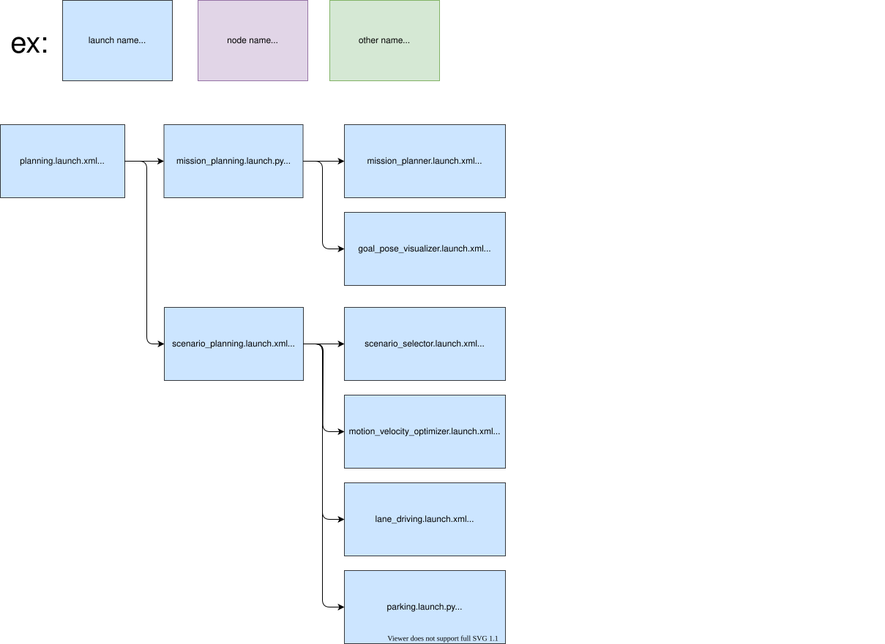

# autoware_planning_launch

Shared planning launch library. The system component launcher lives in the product layer (`autoware_launch/launch/components/component_planning.launch.xml`); this package hosts the planning feature launchers it combines:

```bash
launch/
├── planning.launch.xml             # planning entry: mission planning, trajectory source, validator and evaluator tail
├── mission_planning/
├── learning_based_planning/        # diffusion planner trajectory source
└── scenario_planning/              # rule-based trajectory source
    ├── scenario_planning.launch.xml
    ├── lane_driving.launch.xml
    ├── parking.launch.xml
    └── lane_driving/
        ├── behavior_planning/
        └── motion_planning/
```

## Structure



## Launch files

- `planning.launch.xml` — the entry point. It includes the module preset, resolves every parameter file, and pushes the `planning` namespace. `planning_setting` selects the trajectory source: `rule_based` runs `scenario_planning/`, `diffusion_planner` runs `learning_based_planning/`. The planning validator and the planning evaluator run for both, wired to the source-specific trajectory topics.
- `scenario_planning/` — the rule-based source: the scenario selector, the velocity smoother tail, and the `lane_driving` and `parking` scenarios. `lane_driving` chains behavior planning into motion planning.
- `learning_based_planning/diffusion_planner.launch.xml` — the neural-network source: the diffusion planner followed by the trajectory processor and its optimizer plugins.

## Config

Parameter files are resolved from a `config/` tree addressed through the `planning_config_pkg` argument, which defaults to `autoware_planning_config`. A product can relocate the whole tree by setting `planning_config_pkg` once at its entry point — the launch configuration propagates through every include — but it must then ship the same `config/` layout. Products that differ in only a few files instead override the corresponding `*_param_path` arguments, which are all declared at the top of `planning.launch.xml`:

```xml
<include file="$(find-pkg-share autoware_planning_launch)/launch/planning.launch.xml">
  <arg name="planning_config_pkg" value="my_planning_config"/>
  <arg name="FOO_NODE_param_path" value="..."/>
</include>
```

Which modules launch is a separate axis, selected by `module_preset`; the presets live in the config package under `config/preset/`.

## Package Dependencies

Please see `<exec_depend>` in `package.xml`.
