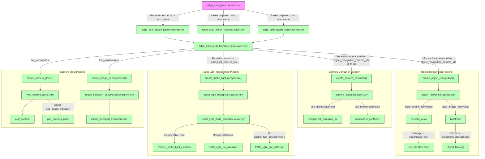

```mermaid
flowchart TD
 subgraph subGraph0["Camera Container Creation"]
        F1["create_camera_container()"]
        F1a["camera_container.launch.py"]
        F1b["component_container_mt"]
        F1c["component_container"]
  end
 subgraph subGraph1["Object Recognition Pipeline"]
        G1["create_object_recognition()"]
        G1a["object_recognition.launch.xml"]
        G2["tensorrt_yolox"]
        G3["bytetrack"]
        G2a["YOLOX Detection"]
        G3a["Object Tracking"]
  end
 subgraph subGraph2["Traffic Light Recognition Pipeline"]
        H1["create_traffic_light_recognition()"]
        H1a["traffic_light_recognition.launch.xml"]
        H2["traffic_light_node_container.launch.py"]
        H3["car/ped_traffic_light_classifier"]
        H5["traffic_light_roi_visualizer"]
        H6["traffic_light_fine_detector"]
  end
 subgraph subGraph3["Camera Input Pipeline"]
        I1["create_camera_driver()"]
        I1a["v4l2_camera.launch.xml"]
        I1b["v4l2_camera"]
        I1c["gpu_process_node"]
        I2["create_image_decompressor()"]
        I2a["image_transport_decompressor.launch.xml"]
        I2b["image_transport_decompressor"]
  end
    A["edge_auto_jetson.launch.xml"] -- Based on jetson_id or ecu_name --> B1["edge_auto_jetson_jetson0.launch.xml"] & B2["edge_auto_jetson_jetson1.launch.xml"] & B3["edge_auto_jetson_addon.launch.xml"]
    B1 --> D["edge_auto_multi_launch_engine.launch.py"]
    B2 --> D
    B3 --> D
    D -- For each camera in either object_recognition_camera_ids or tlr_ids --> F1
    D -- For each camera in either object_recognition_camera_ids --> G1
    F1 --> F1a
    F1a -- "use_multithread=true" --> F1b
    F1a -- "use_multithread=false" --> F1c
    G1 --> G1a
    G1a -- "build_engine_only=false" --> G2 & G3
    G2 -- in/image → input/image_rect --> G2a
    G3 -- in/rect → detection/output/objects --> G3a
    D -- For each camera in traffic_light_camera_ids --> H1
    H1 --> H1a
    H1a --> H2
    H2 -- ComposableNode --> H3 & H5
    H2 -- "if enable_fine_detection=true" --> H6
    D -- "live_sensor=true" --> I1
    I1 --> I1a
    I1a --> I1b
    I1a -- unless use_image_transport --> I1c
    D -- "live_sensor=false" --> I2
    I2 --> I2a
    I2a --> I2b

     F1b:::node
     F1c:::node
     G2:::node
     G3:::node
     H3:::node
     H5:::node
     H6:::node
     I1b:::node
     I1c:::node
     I2b:::node
     A:::entryPoint
    classDef entryPoint fill:#f9f,stroke:#333,stroke-width:2px
    classDef container fill:#bbf,stroke:#333,stroke-width:1px
    classDef node fill:#bfb,stroke:#333,stroke-width:1px
    classDef config fill:#fdb,stroke:#333,stroke-width:1px
```
